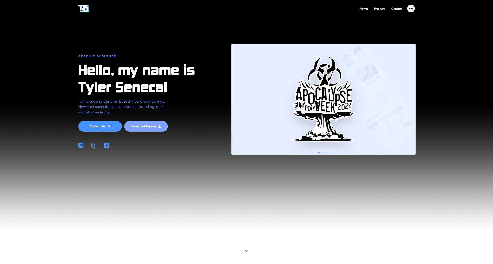
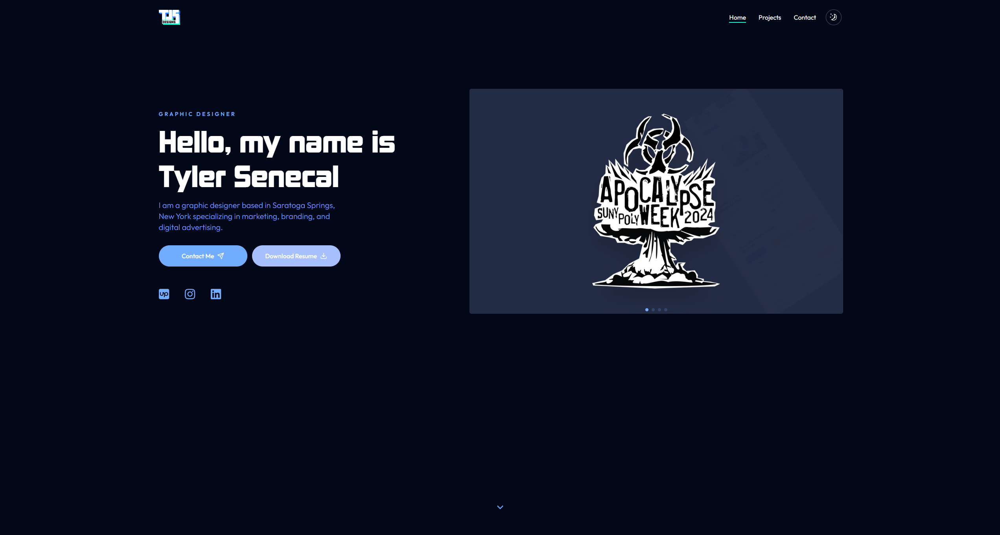

# TJSPortfolio

  

  

  
  </a>

## Description

This is a portfolio website for my client. It showcases their work and provides information about their skills and experience. Feel free to explore the website and get in touch with my client through the provided contact information.

## Features

- **Next.js 14** - Open-source React framework
- **Tailwind CSS 3** - A utility-first CSS framework
- **shadcn-ui** - An accessible and customizable components library
- **Prettier** - Opinionated code formatter
- **[Kimberley](https://typodermicfonts.com/kimberley/)** - A nice font

## Roadmap

Here are some upcoming features that we're planning to implement. Stay tuned!

- [x] Feature 1
  - Create a basic template for the website
- [ ] Feature 2
  - Create an image/video viewer
  - Design custom assets for the website
    - Develop a color scheme
    - Create a custom gradient scroll progress bar
    - Design custom icons
    - Create custom illustrations
- [ ] Feature 3
  - Make a functioning contact form with validation
  - Integrate Google Analytics for tracking website traffic
  - Improve SEO for better visibility on search engines
- [ ] Feature 4
  - Host the Portfolio Website up on [Amazon S3](https://aws.amazon.com/s3/)
    - Set up an Amazon S3 bucket
    - Configure the bucket for website hosting
    - Upload the website files to the bucket
    - Set up a custom domain (if necessary)
    - Enable SSL for secure connections
  - Update the video and image storage onto the server
    - Organize the videos and images in a structured directory
    - Upload the videos and images to the server
    - Set up appropriate access permissions
- [ ] Feature 5
  - Create a custom desktop application that interacts with the portfolio website via SQL
    - Design the application UI/UX
    - Develop the SQL database schema
    - Implement the SQL queries for data manipulation
    - Integrate the desktop application with the portfolio website
    - Test the application for bugs and performance issues
    - Deploy the application and monitor its usage
  
## Installation

If you prefer you can clone this repository and run the following commands inside the project folder:

1. `npm install` or `yarn`;
2. `yarn dev`;

To view the project open `http://localhost:3000`.

## Contributing

1. Fork this repository;
2. Create your branch: `git checkout -b my-new-feature`;
3. Commit your changes: `git commit -m 'Add some feature'`;
4. Push to the branch: `git push origin my-new-feature`.

## License

This project is licensed under the MIT License - see the [LICENSE](LICENSE) file for more information.

## Contact

- Email: contact@danieljpellegrino.com
- GitHub: [danpellegrino](https://github.com/danpellegrino)
