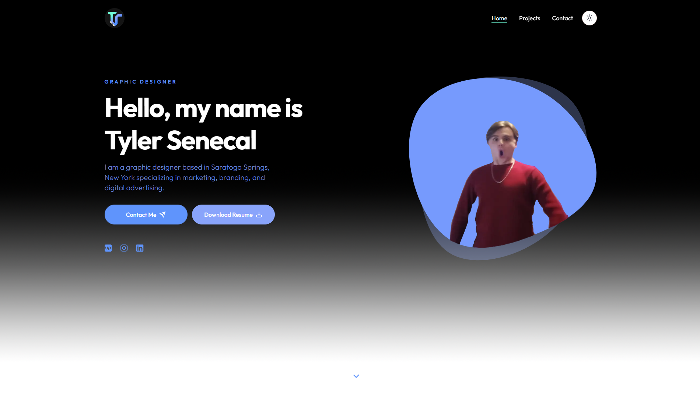

# TJSPortfolio

  

  
  </a>

## Description

This is a portfolio website for my client. It showcases their work and provides information about their skills and experience. Feel free to explore the website and get in touch with my client through the provided contact information.

## Features

- **Next.js 14** - Open-source React framework
- **Tailwind CSS 3** - A utility-first CSS framework
- **shadcn-ui** - An accessible and customizable components library
- **Prettier** - Opinionated code formatter
- **[Kimberley](https://typodermicfonts.com/kimberley/)** - A nice font

## Installation

If you prefer you can clone this repository and run the following commands inside the project folder:

1. `npm install` or `yarn`;
2. `yarn dev`;

To view the project open `http://localhost:3000`.

## Contributing

1. Fork this repository;
2. Create your branch: `git checkout -b my-new-feature`;
3. Commit your changes: `git commit -m 'Add some feature'`;
4. Push to the branch: `git push origin my-new-feature`.

## License

This project is licensed under the MIT License - see the [LICENSE](LICENSE) file for more information.

## Contact

- Email: contact@danieljpellegrino.com
- GitHub: [danpellegrino](https://github.com/danpellegrino)
